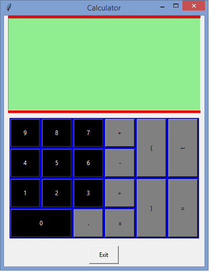

# calculator

This entails an arithmetic calculator implemented using Python 3.7, resulting in the aesthetic interface below:

The source code is available from [here (calculator.py)](calculator.py) while the standalone executable file can be accessed from [here (calculator.exe](calculator.exe)
