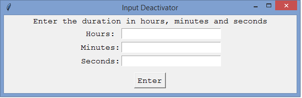

Render keyboard and mouse input inactive for a given period of time in PC running Windows OS.

# Overview
Consider a case where you need to clean your PC's keyboard, touchpad or mouse. It is important that any accidental inputs generated are not recorded.

Consider another case where you need to keep a toddler busy by playing a motion picture/film/animation on your PC. It is paramount in this case too that the input elements be disabled lest the toddler explores your PC environment while unleashing havoc.

In cases similar to the above, input-blocker would be an awesome tool to have running. The program - designed for a Windows Environment - is simple, effective, efficient and easy to use.

The source code is available in the file [a input-block.py](input-block.py).

Input-blocker is also available in .exe format in the file [a input-block.exe](input-block.exe)

# How to use
In order to disable the input devices (such as keyboard, touchpad and mouse) the application must be invoked with admin priviledges, otherwise the disabling/deactivation will not work. The simple steps that follow are then outlined below:
## 1. Enter Duration in Hours, Minutes and seconds in the corresponding field entry and click Enter button

## 2. Confirmation
A dialog box will appear. First select the window that you wish to remain active(on top of other windows) during the deactivated period, then confirm. 

You can also cancel (for instance, if the desired active window is yet to be opened). Which brings up the following interface, after which you can close the application or go back to step 1 above.

## 3. Successful Deactivation
Upon successful confirmation in step 2, the window is hidden from view for the entire period of deactivation. Upon completion of the period, a dialog box alerts the user, who can then quit or set another duration as per step 1.

## As simple as that!!!
